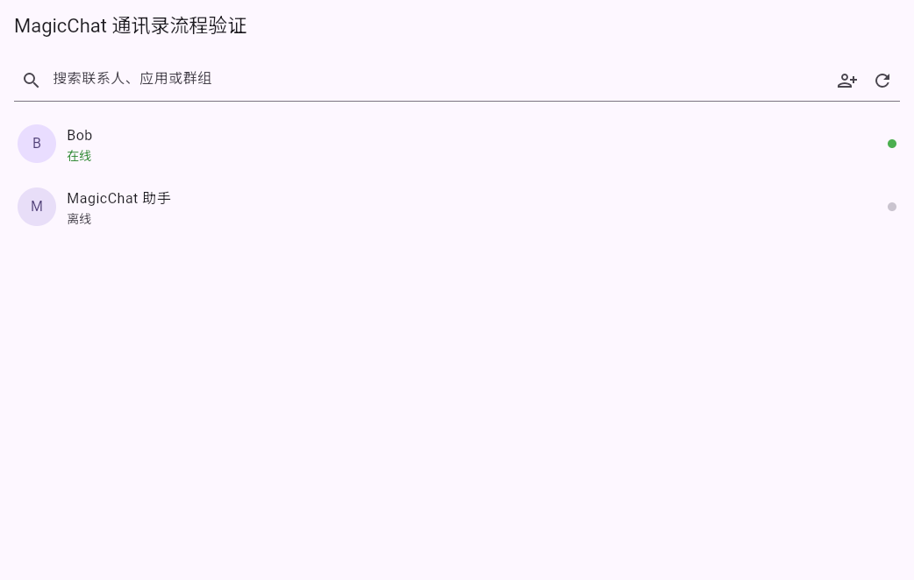
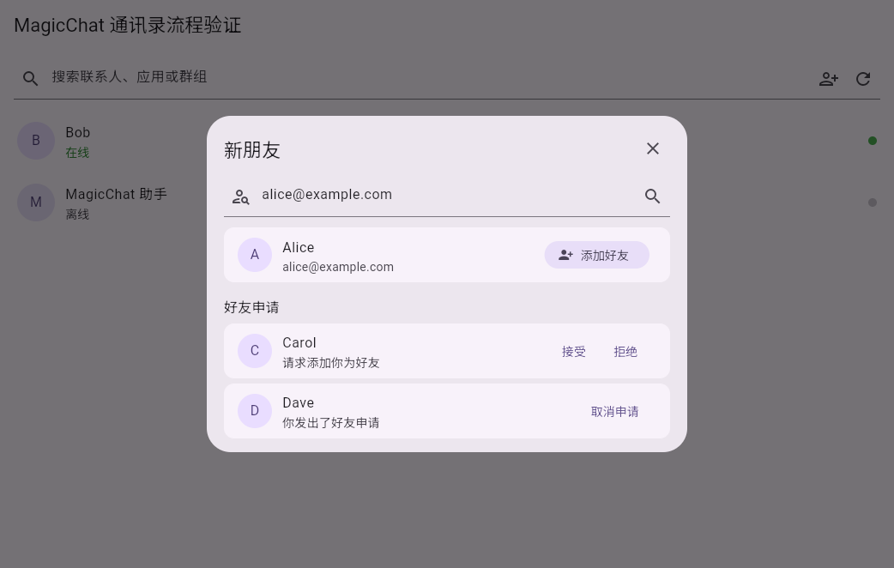

# Flutter 通讯录与好友管理阶段测试报告

- 日期：2026-08-29
- 分支：`feat/flutter-signal-client`
- 测试环境：Flutter 3.47.2、Dart 3.13.2、Docker 28.0.1、Docker Compose 2.33.1
- 覆盖范围：通讯录 feature 拆分、目录模式解析、用户精确查找、好友申请发送/接受/拒绝/取消、原有一级导航回归

## Docker 测试服务

使用仓库根目录 `compose.yml` 启动 PostgreSQL、Server、Document Server 与 Caddy；Assistant 依赖外部模型配置，本阶段未启动。

| 服务 | 状态 | 验证 |
| --- | --- | --- |
| postgres | healthy | PostgreSQL 迁移完成，持久化目录可用 |
| server | healthy | 容器内 `/healthz` 通过 |
| document-server | healthy | 容器内 `/healthz` 通过 |
| caddy | healthy | HTTP 301 到 HTTPS；客户端 HTTPS 200；管理端 HTTPS 200 |

运行数据占用约 76 MB；四个测试环境镜像合计约 693 MB。客户端入口为 `https://localhost/`，管理端入口为 `https://localhost:1443/`。本地 CA 未加入系统信任时需要手动接受证书。

## 自动化验证

| 命令 | 结果 | 覆盖 |
| --- | --- | --- |
| `flutter analyze lib/features/contacts test/contact_repository_test.dart test/contacts_page_test.dart` | 通过，0 issues | 新增 feature 与测试静态检查 |
| `flutter test test/contact_repository_test.dart test/contacts_page_test.dart` | 通过，4 tests | 精确搜索两段 API、Bearer 头、目录模式、好友模式 UI、组织模式入口隔离 |
| `flutter test test/widget_test.dart` | 通过，2 tests | 一级导航与会话草稿回归 |
| `dart format ...` | 通过 | 本阶段 Dart 文件格式化 |
| `git diff --check` | 通过 | 空白错误检查 |

全量多平台构建与全量测试保留给 GitHub Actions；本地只执行本阶段直接相关门禁。

## 流程截图

1. 好友模式通讯录：仅在服务端返回 `directory_mode=friends` 时显示“新朋友”入口。

2. 新朋友流程：使用完整邮箱查找用户，展示解析后的昵称/邮箱，并同时处理收到和发出的申请。

截图由 `test_driver/friend_management_harness.dart` 在真实 Flutter Web/Chromium 渲染环境中生成，分辨率为 1042x662；测试数据不包含生产凭据。

## 结论与未覆盖项

本阶段通过：Flutter 已与当前 Web 原版的“新朋友”流程对齐，并把通讯录页面从单文件入口拆入独立 feature。当前长期目标仍未完成；后续还需继续拆分项目、消息、设置模块，并完成 APNs/JPush 厂商 SDK、文档协作协议以及 Android/iOS/Windows/macOS/Linux 真机矩阵。
