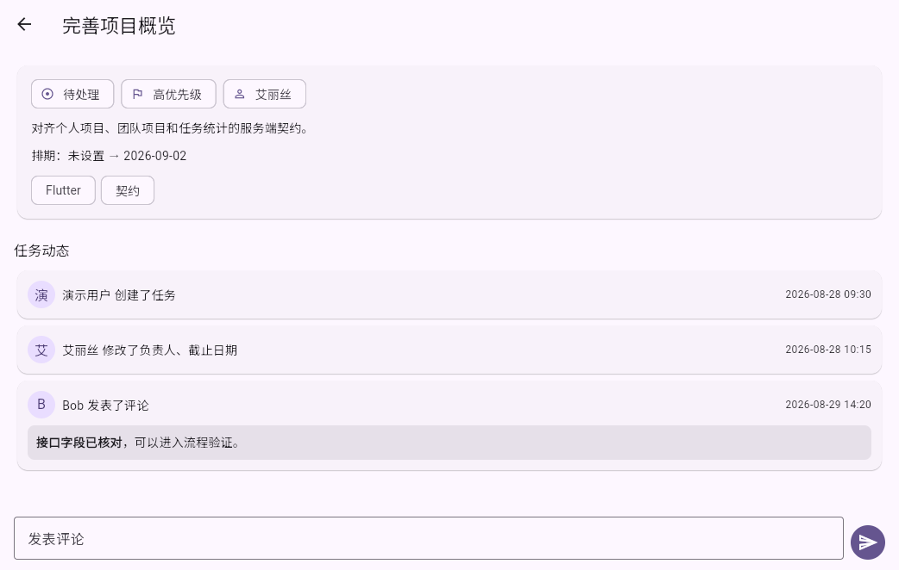
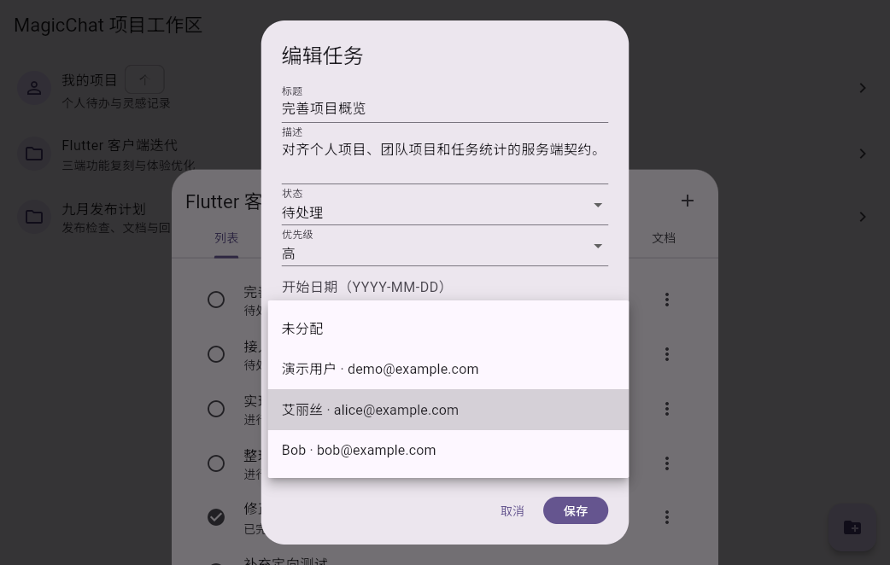

# Flutter 任务详情与成员选择阶段测试报告

- 日期：2026-08-29
- 分支：`feat/flutter-signal-client`
- 测试环境：Flutter 3.47.2、Dart 3.13.2、Docker 28.0.1、Docker Compose 2.33.1
- 覆盖范围：项目成员分页、嵌套任务用户、任务详情、创建/修改/评论动态、Markdown 评论、负责人选择器

## Docker 测试服务

沿用仓库根目录 `compose.yml` 测试环境；PostgreSQL、Server、Document Server 与 Caddy 均为 `running/healthy`，客户端与管理端 HTTPS 入口均返回 HTTP 200。项目成员和任务动态接口由当前 Server 容器提供。

## 自动化验证

| 命令 | 结果 | 覆盖 |
| --- | --- | --- |
| `flutter analyze lib/features/projects lib/domain/models.dart test/project_repository_test.dart test/projects_page_test.dart` | 通过，0 issues | 项目详情 feature、模型与专项测试静态检查 |
| `flutter test test/project_repository_test.dart test/projects_page_test.dart test/widget_test.dart` | 通过，13 tests | 成员游标分页、用户摘要、动态解析、评论回显、详情 UI、成员选择器及一级导航回归 |
| `flutter build web --target=test_driver/project_workspace_harness.dart --release --no-wasm-dry-run` | 通过 | Flutter Web 流程截图构建 |
| `git diff --check` | 通过 | 空白错误检查 |

本分支的 `client-flutter` GitHub Actions 还会执行全量格式、analyze、test、Web Release 与 Linux Debug 构建。

## 流程截图

1. 任务详情：展示状态、优先级、负责人、描述、排期、标签以及创建/修改/评论动态；评论正文按 Markdown 渲染。

2. 负责人选择：从 `/api/client/projects/:project_id/members` 按游标拉取项目成员，使用展示名和邮箱选择，不再要求用户手填 UUID。

截图由 `test_driver/project_workspace_harness.dart` 在真实 Flutter Web/Chromium 环境中生成，分辨率为 1042x662；测试数据不包含生产凭据。

## 结论与未覆盖项

本阶段通过：任务列表点击进入独立详情页，服务端动态和新评论可以连续回显；任务编辑负责人使用项目成员数据，嵌套 `assignee` 信息会保留用于展示。

长期目标仍未完成。项目域后续还需补项目搜索和分页、目标管理、成员/群组授权管理及完整的新建任务表单；文档正文的 Hocuspocus/Yjs 协作仍是独立阶段。
