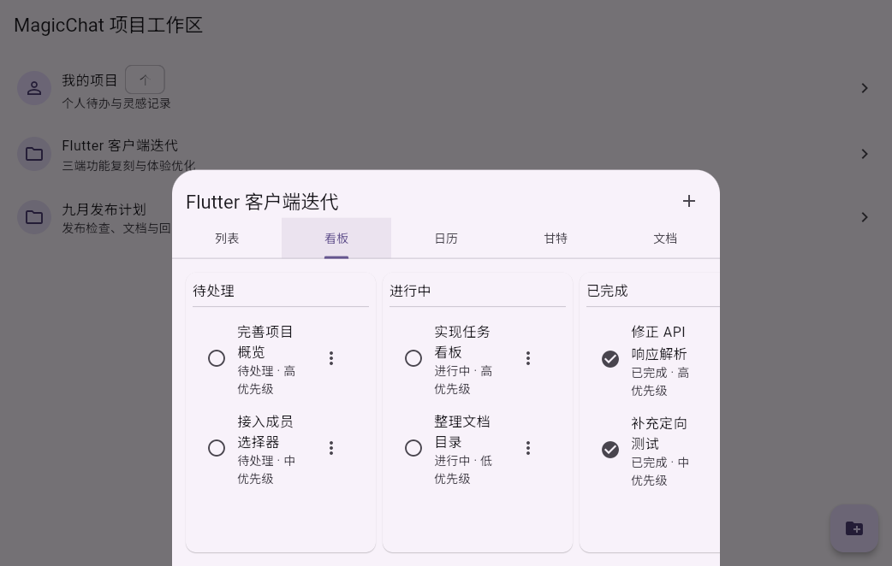
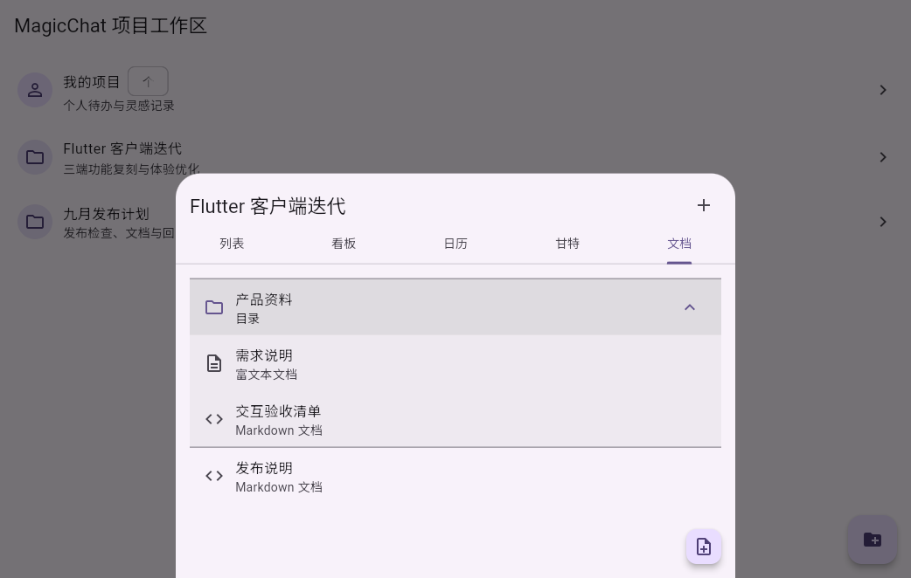
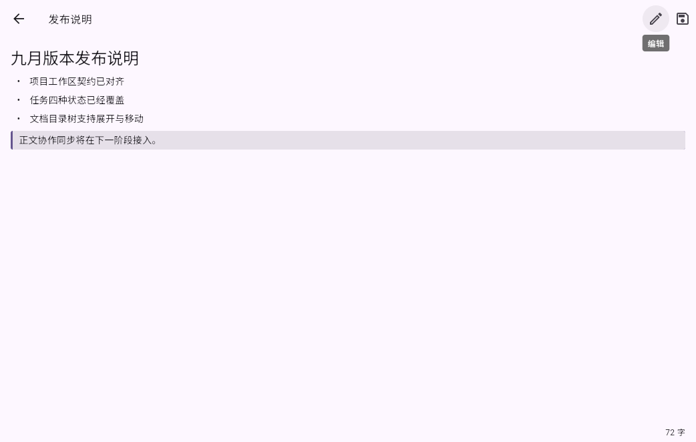

# Flutter 项目工作区阶段测试报告

- 日期：2026-08-29
- 分支：`feat/flutter-signal-client`
- 测试环境：Flutter 3.47.2、Dart 3.13.2、Docker 28.0.1、Docker Compose 2.33.1
- 覆盖范围：项目模块拆分、项目摘要、任务五视图与四状态、任务字段清空、文档目录树、Markdown 预览、文档标题协作接口

## Docker 测试服务

仓库根目录 `compose.yml` 中的 PostgreSQL、Server、Document Server 与 Caddy 均处于 `running/healthy`；客户端与管理端 HTTPS 入口均返回 HTTP 200。Assistant 依赖外部模型配置，本阶段未启动。

| 服务 | 状态 | 用途 |
| --- | --- | --- |
| postgres | healthy | 项目、任务、文档元数据持久化 |
| server | healthy | `/api/client/projects`、任务与文档 API |
| document-server | healthy | 文档标题协作接口与后续 Yjs 正文协议 |
| caddy | healthy | `https://localhost/` 与 `https://localhost:1443/` |

Docker 测试数据当前占用约 76 MB。截图用 Chromium 与 Playwright 已安装在大容量数据盘关联环境中，没有新增系统盘浏览器副本。

## 自动化验证

| 命令 | 结果 | 覆盖 |
| --- | --- | --- |
| `flutter analyze lib/features/projects lib/domain/models.dart test/project_repository_test.dart test/projects_page_test.dart` | 通过，0 issues | 项目 feature、模型与专项测试静态检查 |
| `flutter test test/project_repository_test.dart test/projects_page_test.dart test/widget_test.dart` | 通过，9 tests | 直接 `data` 响应、负责人解析、显式 null、个人项目、五视图、四状态、目录树、Markdown 预览、一级导航 |
| `flutter build web --target=test_driver/project_workspace_harness.dart --release --no-wasm-dry-run` | 通过 | 真实 Flutter Web 发布构建与截图入口 |
| `dart format ...` | 通过 | 本阶段 Dart 文件格式化 |
| `git diff --check` | 通过 | 空白错误检查 |

全量三端构建与全量测试交给 GitHub Actions；本地只执行本阶段直接相关门禁。

## 已核对的服务端契约

- 项目、文档创建和更新成功响应直接位于 `data`，不再误读 `data.project` 或 `data.document`。
- 项目列表保留 `personal_project`、`description`、`avatar`、`is_personal` 与 `updated_at`；列表接口不提供任务统计，因此不再显示虚假的“0 个任务”。
- 任务负责人从 `assignee.id` 读取；优先级按 `1=低、2=中、3=高` 展示。
- 任务 PATCH 会明确发送日期、负责人和提醒的 `null`，使“清空”与“未修改”语义可区分。
- 普通文档标题使用 `/api/client/document/collaboration/:document_id/title`；目录重命名仍使用元数据 PATCH。

## 流程截图

1. 项目概览：个人项目与团队项目分开展示，不伪造任务数。

2. 任务看板：工作区提供列表、看板、日历、甘特和文档五种视图；自动化测试覆盖待处理、进行中、已完成和已取消四种状态。

3. 文档目录：按 `parent_id` 与 `sort_order` 构建可展开目录树，区分富文本与 Markdown 文档。

4. Markdown 草稿：编辑区具备真实 Markdown 预览，标题保存走协作服务；正文当前明确作为本机草稿保存。

截图由 `test_driver/project_workspace_harness.dart` 在真实 Flutter Web/Chromium 环境中生成，分辨率为 1042x662；测试数据不包含生产凭据。

## 结论与未覆盖项

本阶段通过：项目模块已从 `main.dart` 拆入独立 feature，修复了会造成“服务端写入成功但 Flutter 报失败”的响应解析问题，并闭环当前 UI 已提供的项目、任务与文档元数据流程。

长期的“原版三端 1:1”目标仍未完成。下一阶段至少还需接入 Hocuspocus/Yjs 正文协作、项目搜索与游标分页、目标管理、成员和群组授权、任务详情活动流及成员选择器；这些能力不能用当前本机草稿或手填用户 ID 代替。
