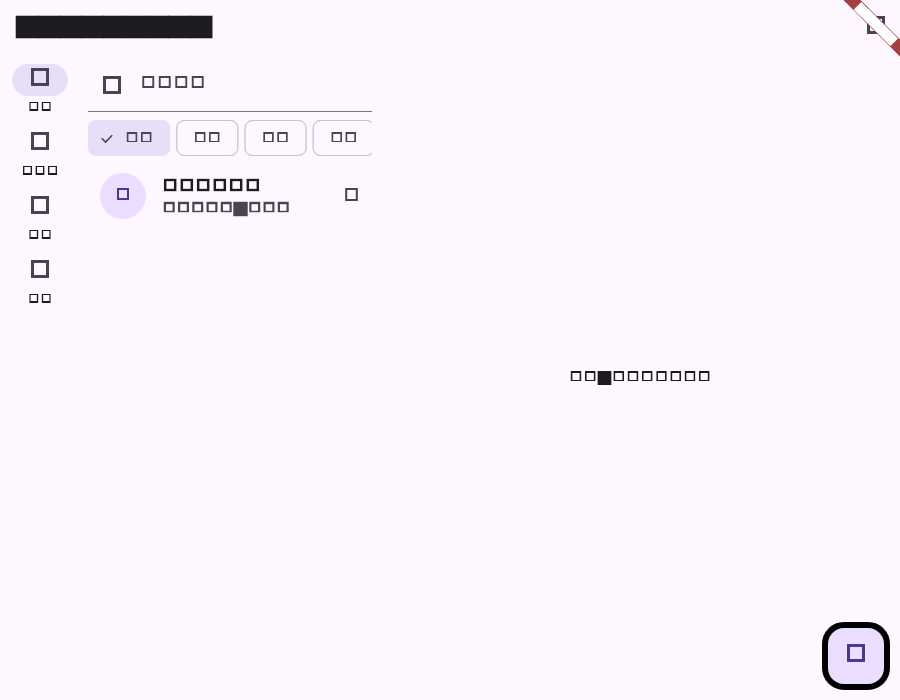

# Flutter 会话提及与选择提醒阶段验证

## 范围

- 会话模型解析服务端 `last_mentioned_seq`，并在实时 `conversation.member_mentioned` 事件中更新提醒序号。
- 同步处理 `conversation.member_choice_received`，保持选择题提醒的最大序号。
- 未读筛选和会话列表展示提及/选择提醒图标；普通未读数量仍使用服务端 `unread_count`。

## 自动化验证

| 命令 | 结果 | 覆盖 |
| --- | --- | --- |
| `dart format lib/domain/models.dart lib/data/realtime_store.dart lib/features/messages/conversation_list.dart lib/main.dart test/realtime_store_test.dart test/conversation_list_test.dart` | 通过 | Dart 格式 |
| `flutter test --no-pub test/realtime_store_test.dart test/conversation_list_test.dart` | 通过（21 项） | 实时提醒序号、未读筛选、提及图标及截图 |
| `flutter analyze --no-pub lib/domain/models.dart lib/data/realtime_store.dart lib/features/messages/conversation_list.dart lib/main.dart test/realtime_store_test.dart test/conversation_list_test.dart` | 通过；无 error | 静态检查 |
| `git diff --check` | 通过 | 空白错误检查 |

## 流程截图

截图由 `conversation_list_test.dart` 生成，展示没有普通未读数量但有提及序号的会话标记。

## 未覆盖项

真实推送通知和服务端已读游标联调仍需在 CI/真机环境验证；当前点击会话会按最新消息序号调用既有已读接口。
