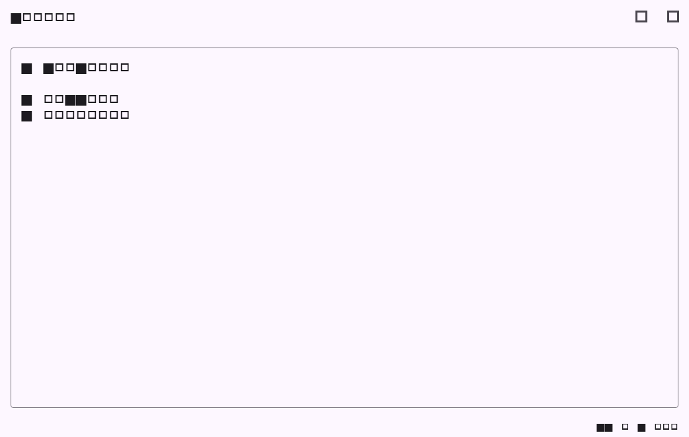

# Flutter Markdown 文档协作阶段验证

## 范围

- 使用 Docker Compose 的 Postgres、Go Server、Document Server 和 Caddy 作为本地测试环境。
- Flutter Markdown 文档绑定服务端 `Y.Text("markdown")`，覆盖认证后同步、远端正文灌入、本地更新回传、连接状态和失败清理。
- 富文本 `Y.XmlFragment("body")` 尚未在 Flutter 原生编辑器中实现，本阶段不把富文本伪装成 Markdown。

## 本地服务

| 检查项 | 结果 |
| --- | --- |
| `docker compose ps` | `postgres`、`server`、`document-server`、`caddy` 均为 running/healthy |
| `docker exec magic-chat-server wget -qO- http://127.0.0.1:20080/healthz` | 返回 `{"success":true,"data":{"status":"ok"}}` |
| `docker exec magic-chat-document-server wget -qO- http://127.0.0.1:20100/healthz` | 返回 `{"status":"ok"}` |
| `curl -kfsS https://localhost/gateway-healthz` | 返回 HTTP 200 / `ok` |

本机 `/mnt` 磁盘剩余约 84 GB。Compose 数据目录约 76 MB；未启动需要外部 LLM/MCP 凭据的 Assistant。

## Flutter 验证

| 命令 | 结果 | 目的 |
| --- | --- | --- |
| `dart format --set-exit-if-changed ...` | 通过 | 本阶段 Dart 格式 |
| `flutter analyze --no-fatal-infos` | 通过；无 error/warning，仅仓库既有 info | 静态检查 |
| `flutter test test/document_collaboration_test.dart test/document_realtime_test.dart test/projects_page_test.dart test/document_collaboration_screenshot_test.dart` | 通过，14 项 | Yjs/Hocuspocus、项目页面和编辑器渲染回归 |
| `flutter build web --release --no-wasm-dry-run` | 通过 | Web 发布编译 |
| `git diff HEAD --check` | 通过 | 空白检查 |

## 流程截图

截图由 Flutter Widget golden 流程生成，分辨率为 1042x662，使用无凭据的模拟 WebSocket 会话灌入远端 Markdown 正文，并显示“已同步”状态。真实账号登录、跨设备并发和 Android/iOS/Windows/macOS/Linux 真机矩阵仍需在对应环境执行。
