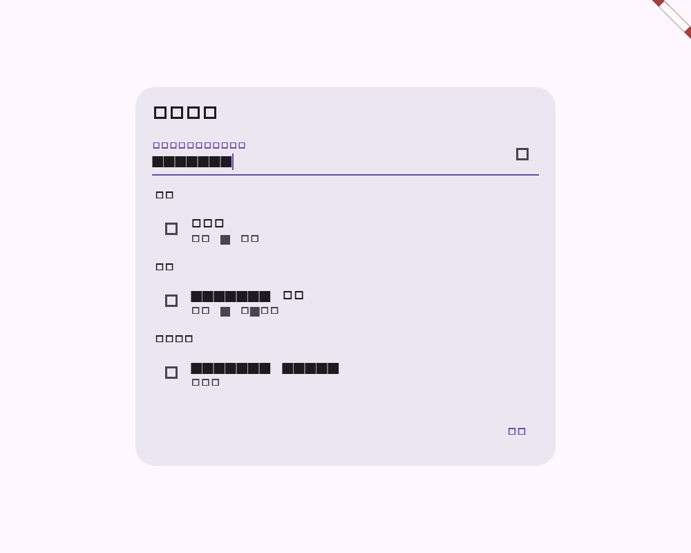

# Flutter 综合搜索验证（2026-08-30）

## 覆盖范围

- 搜索入口改为“综合搜索”，关键词同时匹配会话、联系人、项目和服务端聊天记录。
- 会话、联系人、项目复用 `MagicChatRepository` 的现有列表接口；聊天记录继续调用 `searchMessages`。
- 点击聊天记录仍按原行为打开所属会话；会话、联系人和项目结果分别切换到对应主导航页。
- 聊天记录遵循服务端搜索的最小 2 字符约束，本地索引支持单字符关键词。

## 自动化证据

```text
cd client-flutter
flutter test test/global_search_test.dart
00:00 +3: All tests passed!
```

测试覆盖纯搜索结果分组、空关键词，以及综合搜索对话框加载真实 repository 方法并保持消息跳转。



截图由上述 Widget 测试生成，展示会话、项目和聊天记录分组结果。
