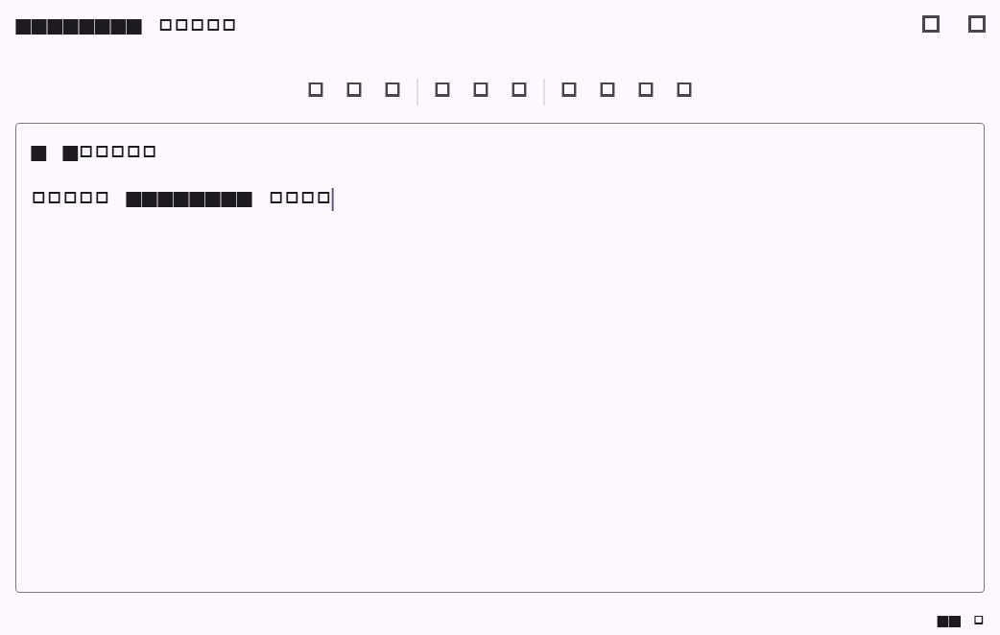

# Flutter Markdown 编辑工具栏阶段验证

## 覆盖范围

- Markdown 文档编辑页新增横向滚动格式工具栏，与本机草稿和 Yjs `Y.Text("markdown")` 共用同一正文控制器。
- 支持粗体、斜体、删除线、无序/有序/任务列表、链接、图片、分割线和表格模板；选区会保留在可继续编辑的位置。
- 预览模式或协作连接中的正文不可编辑时，工具栏按钮同步禁用。

## 验证命令

| 命令 | 结果 | 说明 |
| --- | --- | --- |
| `dart format --set-exit-if-changed lib/features/projects/markdown_editor_toolbar.dart lib/features/projects/document_editor_page.dart test/markdown_editor_toolbar_test.dart` | 通过 | 本阶段 Dart 格式 |
| `flutter test test/markdown_editor_toolbar_test.dart` | 通过，5 项 | 纯文本转换、按钮回写、工具栏流程截图 |
| `flutter test test/document_collaboration_screenshot_test.dart --plain-name='Markdown 协作编辑器流程截图'` | 通过 | 协作 Markdown 页面回归截图已更新 |

## 流程截图

截图由 `Markdown 工具栏流程截图` Widget 测试在 1042x662 视口生成；未使用真实账号或服务端凭据。
