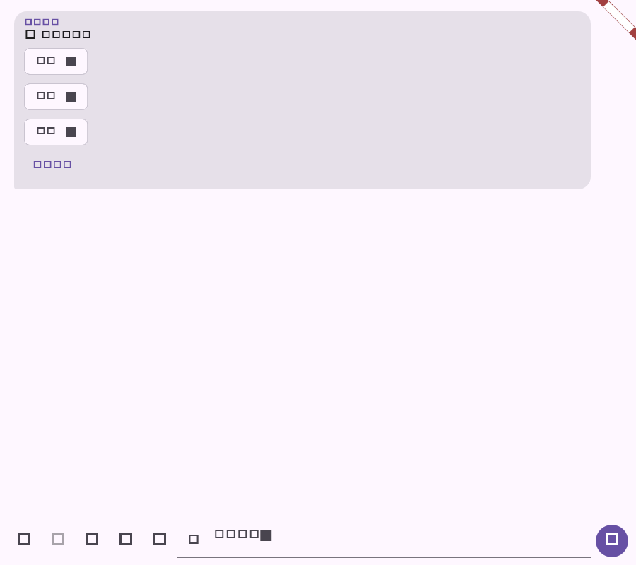

# Flutter 选择消息阶段验证

## 范围

- 消息模型解析服务端 `choice` 状态，保留当前用户已选项、各选项响应数和总响应数。
- `message.choice_updated` 实时事件更新选择状态，并根据当前用户 ID 应用 `actor_option_ids`。
- 选择消息 UI 区分单选和多选：单选立即提交，多选先勾选多个选项再一次提交；已提交选项和响应人数可见。

## 自动化验证

| 命令 | 结果 | 覆盖 |
| --- | --- | --- |
| `dart format --set-exit-if-changed lib/domain/models.dart lib/data/repository.dart lib/data/realtime_store.dart lib/main.dart test/realtime_store_test.dart test/app_repository_test.dart test/message_choice_test.dart` | 通过 | 选择状态模型、仓库、实时投影、消息 UI 与测试格式 |
| `flutter test --no-pub test/realtime_store_test.dart test/app_repository_test.dart test/message_choice_test.dart` | 通过（25 项） | HTTP/实时选择状态、单/多选交互和 golden 截图 |
| `flutter analyze --no-pub lib/domain/models.dart lib/data/repository.dart lib/data/realtime_store.dart lib/main.dart test/message_choice_test.dart` | 通过；无 error，仅仓库既有 info | 静态检查 |
| `git diff --check` | 通过 | 空白错误检查 |

## 流程截图

截图由 `message_choice_test.dart` 生成，分辨率为 900x800，展示多选消息的选项和提交入口。

## 未覆盖项

断线恢复时批量查询选择快照（`messages/choices/query`）及真实账号权限错误仍需在登录环境补齐；当前提交响应通过实时事件回流更新状态。
