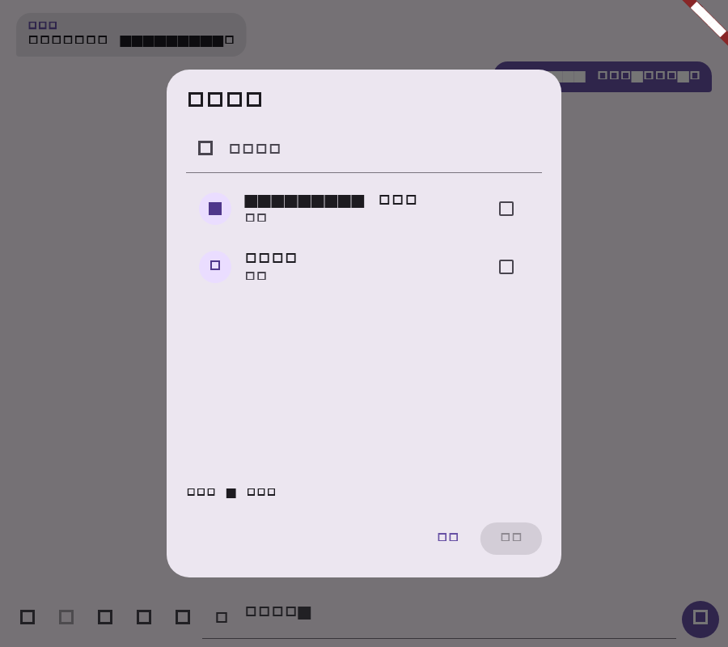

# Flutter 多消息转发阶段验证

## 范围

- `MagicChatRepository`、`HttpMagicChatRepository` 和 `DemoRepository` 支持 typed 多消息、多目标转发请求；合并转发消息在历史消息中展示为聊天记录卡片。
- 消息操作和多选工具栏使用会话列表选择目标，支持逐条/合并模式、部分成功结果和失败目标重试。

## 自动化验证

| 命令 | 结果 | 覆盖 |
| --- | --- | --- |
| `dart format --set-exit-if-changed lib/domain/message_content.dart lib/domain/models.dart lib/data/repository.dart lib/main.dart test/message_forwarding_test.dart` | 通过 | 本阶段 Dart 文件格式 |
| `flutter test test/message_forwarding_test.dart` | 通过（5 项） | HTTP 请求/响应、Demo 结果、单选和多选转发交互、截图回归 |
| `flutter test test/widget_test.dart` | 通过（2 项） | 消息面板与草稿回归 |
| `flutter analyze --no-pub lib/domain/models.dart lib/data/repository.dart lib/main.dart` | 通过；无 error，仅仓库既有 info | 静态检查 |
| `git diff --check` | 通过 | 空白错误检查 |

## 已实现契约

- 请求携带 `client_forward_id`、`message_ids`、`mode`（`separate`/`merged`）和 `target_conversation_ids`。
- UI 与兼容仓储方法生成符合服务端约束的 UUID v4 幂等键。
- 响应解析 `sent_count`、`failed_count` 及每个目标的 `sent`/`failed`、错误和已创建消息。
- 转发目标按会话名称搜索，最多选择 20 个；部分失败仅保留失败目标供重试，全部成功后清理多选状态。

## 流程截图

截图由 Flutter Widget golden 流程生成，分辨率为 900x800；展示消息操作打开的会话目标选择器和逐条转发入口。

## 未覆盖项

真实账号权限拒绝、跨设备实时消息回流和服务端转发内容的端到端流程仍需在 CI/测试环境验证。
