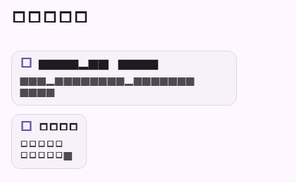

# Flutter 链接与卡片消息验证

## 范围

- `MessageContent` 为 `link`/`card` 生成与 Web、Desktop、Mobile 一致的稳定摘要，并保留完整原始 body。
- `_MessageBubble` 使用独立 `MessageLinkCard` 展示标题、说明/地址；只有带主机的 HTTP(S) 地址才会调用系统浏览器。
- 卡片的 `/projects/...` 内部路径通过可配置回调进入项目页；链接消息不启用内部路由。
- `javascript:`、`data:`、缺失 scheme、空白和反斜杠地址只展示内容，不触发外链打开。

## 自动化验证

| 命令 | 结果 | 覆盖 |
| --- | --- | --- |
| `flutter test test/message_content_test.dart test/message_link_card_test.dart` | 通过（14 项；含 golden） | 摘要/raw、URL 校验、内部路由回调、不安全地址、ConversationView 接入、截图 |
| `flutter analyze --no-pub lib/domain/message_content.dart lib/features/messages/message_link_card.dart lib/main.dart test/message_content_test.dart test/message_link_card_test.dart` | 通过；无 error，仅仓库既有 info | 静态检查 |
| `dart format --set-exit-if-changed lib/domain/message_content.dart lib/features/messages/message_link_card.dart lib/main.dart test/message_content_test.dart test/message_link_card_test.dart` | 通过 | Dart 格式 |
| `git diff --check` | 通过 | 空白错误检查 |

## 流程截图

截图由 `message_link_card_test.dart` 生成，分辨率为 420x260，包含 HTTPS 链接卡片和内部项目卡片。

## 未覆盖项

系统浏览器是否实际接管 URL 由各平台 `url_launcher` 插件和运行环境决定；本地 Widget 测试验证了回调 URI 及不安全地址阻断，真实设备接管流程交由 CI/平台验收。
