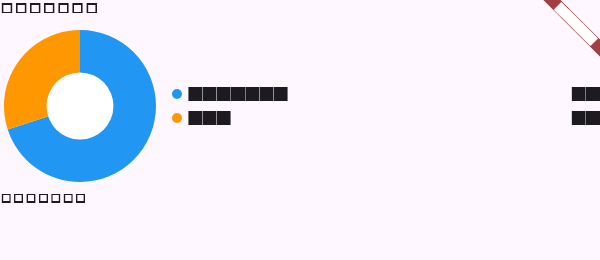

# Flutter 结构化消息兼容验证

本阶段补齐了与服务端及移动端协议一致的消息展示细节：图片说明（文本、Markdown 和提及）、文件名与大小、语音摘要（时长和转录）、未知消息占位，以及带标题/描述和图例的饼图预览。Markdown 正文链接统一限制为带主机的 HTTP(S) 地址。

## 定向验证

| 命令 | 结果 |
| --- | --- |
| `flutter test --no-pub test/message_content_test.dart test/message_chart_test.dart` | 通过，13 项 |
| `flutter analyze --no-pub lib/domain/message_content.dart lib/main.dart` | 无 error，仅既有 info lint |

截图由 Flutter golden 测试生成；当前无 CJK 字体的环境可能将中文渲染为方框，但图表、图例与布局仍可核验。
