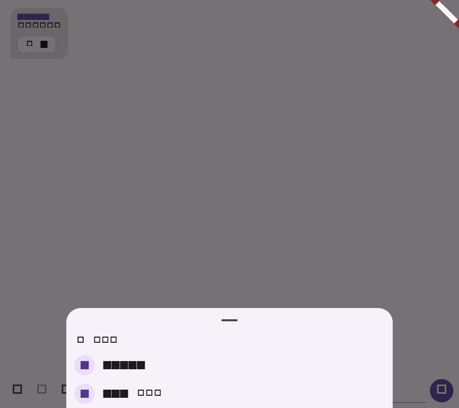

# Flutter 表情参与者查看阶段验证

## 范围

- 消息表情模型和实时事件保留参与者 ID/名称；缺少名称时使用通讯录或用户 ID 展示。
- HTTP 仓库通过 `GET /api/client/conversations/:conversationId/messages/:messageId/reactions/users?text=...` 查询参与者，并校验会话、消息和表情文本回显。
- 消息气泡长按表情打开参与者底部列表；点击表情的原有反应行为保持不变。

## 自动化验证

| 命令 | 结果 | 覆盖 |
| --- | --- | --- |
| `dart format --set-exit-if-changed lib/main.dart lib/data/repository.dart lib/data/realtime_store.dart lib/domain/models.dart test/realtime_store_test.dart test/app_repository_test.dart test/message_reaction_test.dart` | 通过 | 本阶段 Dart 格式 |
| `flutter test test/realtime_store_test.dart test/app_repository_test.dart test/message_reaction_test.dart` | 通过（20 项） | 实时参与者投影、HTTP 路径/响应校验、长按参与者列表交互和截图 |
| `flutter analyze --no-pub lib/main.dart lib/data/repository.dart lib/data/realtime_store.dart lib/domain/models.dart test/message_reaction_test.dart` | 通过；无 error，仅仓库既有 info | 静态检查 |
| `git diff --check` | 通过 | 空白错误检查 |

## 流程截图

截图由 `message_reaction_test.dart` 生成，分辨率为 900x800；展示长按“👍”后按服务端参与者数据和通讯录补全名称的底部列表。

## 未覆盖项

真实账号权限拒绝、参与者数量较大时的分页，以及 Android/iOS/Windows/macOS/Linux 真机触控反馈仍需在 CI 或对应平台验收。
