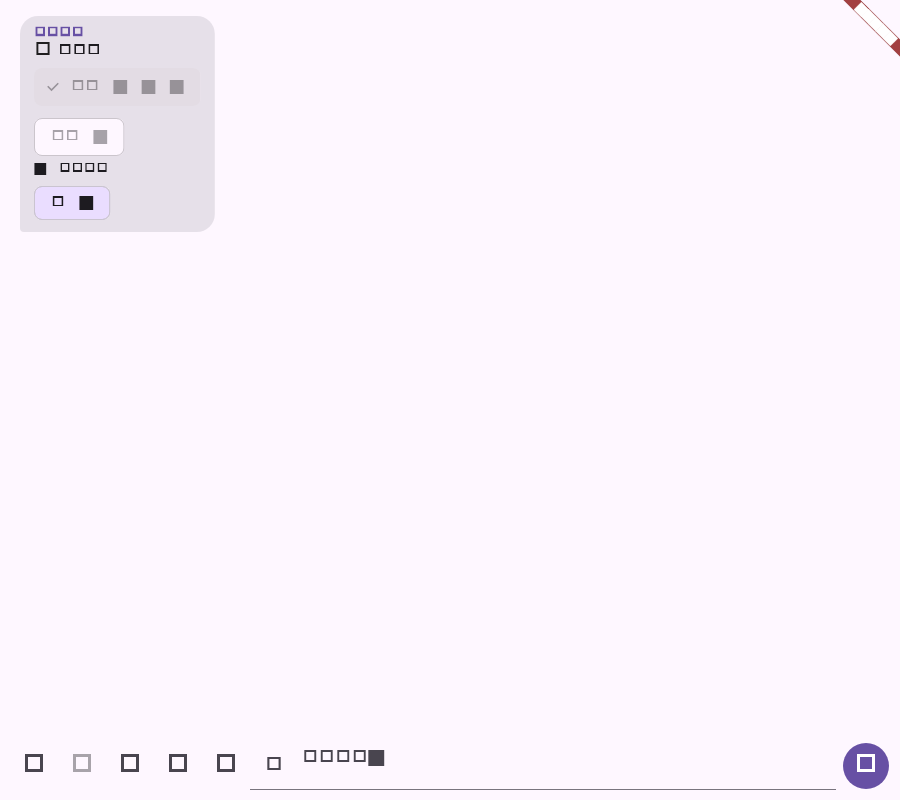

# Flutter 消息快照恢复验证

## 范围

- 历史消息按批量接口恢复 choice 的本人选项、响应人数和选项统计。
- 历史消息按批量接口恢复 reaction 的版本、数量和当前用户状态。
- 快照接口失败时保留消息接口已有状态，不阻断首屏加载；请求按 100 条分批并保持消息顺序。
- 项目任务列表支持 `cursor`、`limit`、关键词、状态和优先级筛选，并解析 `next_cursor`。

## 自动化验证

| 命令 | 结果 |
| --- | --- |
| `dart format --set-exit-if-changed lib/data/repository.dart lib/domain/models.dart lib/main.dart test/project_repository_test.dart test/message_snapshot_repository_test.dart` | 通过 |
| `flutter test test/project_repository_test.dart test/message_snapshot_repository_test.dart` | 通过（14 项） |
| `flutter analyze` | 退出 0；无 error，仅既有 info lint |
| `git diff --check` | 通过 |

截图由 `message_snapshot_repository_test.dart` 生成，展示历史 choice 与 reaction 状态在后台快照完成后的更新结果。
