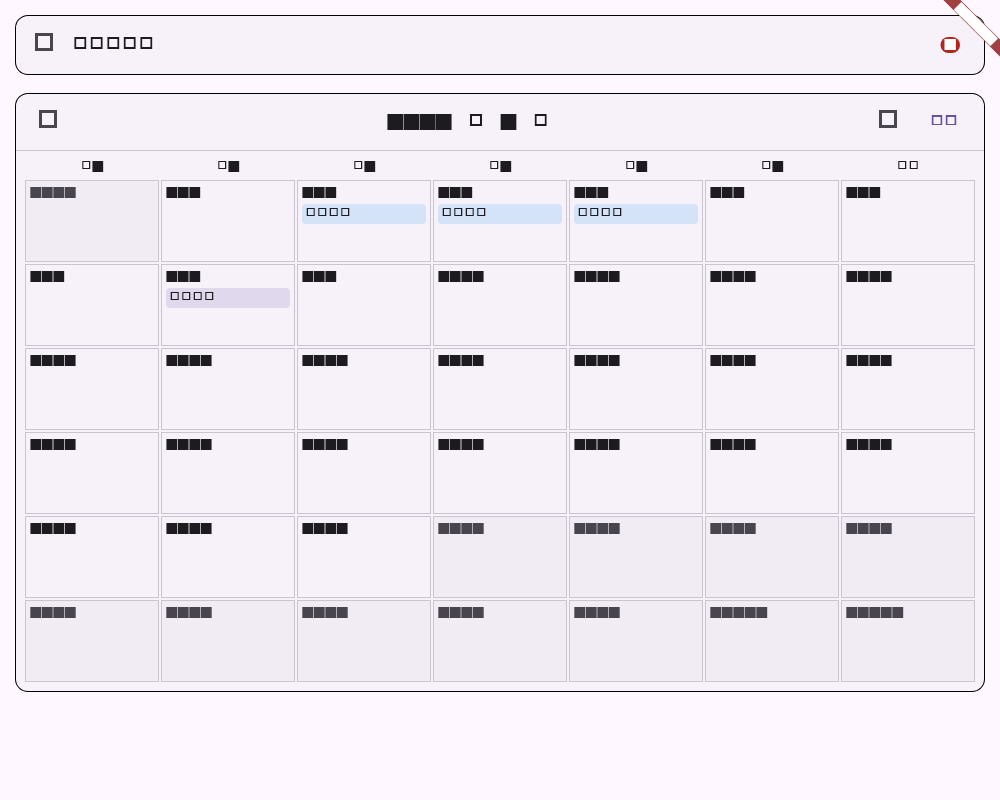

# Flutter 项目任务月历阶段验证

## 范围

- 项目任务日历由按日期排序列表升级为月历：按开始/截止日期范围铺开任务，单日任务显示在对应日期。
- 未设置日期的任务独立收纳在可展开分组中，避免混入有排期的日期网格。
- 月历支持上/下月和“今天”跳转；日期任务与未排期任务点击均进入已有任务详情页，不再误推进任务状态。

## 自动化验证

| 命令 | 结果 | 覆盖 |
| --- | --- | --- |
| `dart format --set-exit-if-changed lib/features/projects/project_task_calendar_view.dart lib/features/projects/projects_page.dart test/project_task_calendar_test.dart` | 通过 | 月历组件、项目入口与测试格式 |
| `flutter test test/project_task_calendar_test.dart` | 通过（2 项） | 日期范围铺开、未排期展开、详情回调、月份切换和 golden 截图 |
| `flutter test test/projects_page_test.dart` | 通过（10 项） | 项目工作区、任务视图、详情和既有项目回归 |
| `flutter analyze --no-pub lib/features/projects/project_task_calendar_view.dart lib/features/projects/projects_page.dart test/project_task_calendar_test.dart` | 通过；无 issues | 静态检查 |
| `git diff --check` | 通过 | 空白错误检查 |

## 流程截图

截图由 `project_task_calendar_test.dart` 生成，分辨率为 1000x800，固定展示 2026 年 9 月任务月历和跨日任务。

## 未覆盖项

月历仍使用本地日期（不显示具体时区时间），大量任务的分页/虚拟化和跨平台真机触控矩阵需在 CI 或对应平台验收。
