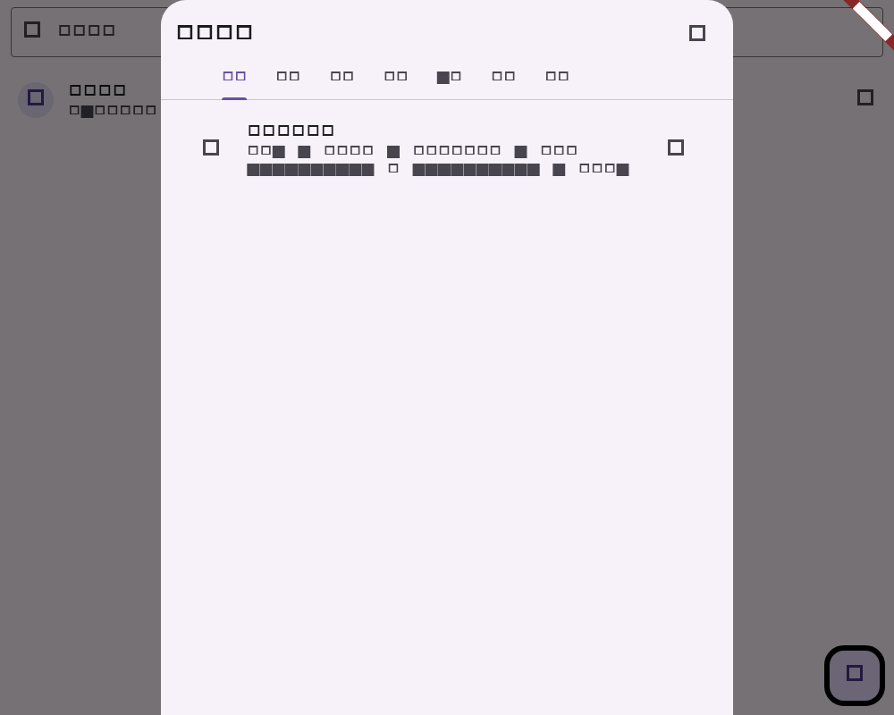

# Flutter 任务列表摘要阶段验证

## 范围

- 项目任务列表摘要补齐负责人、开始/截止日期和标签信息，与 Web/Desktop 列表视图保持同一信息密度。
- 保留既有状态与优先级摘要；无负责人、排期或标签的任务不显示虚假字段。

## 自动化验证

| 命令 | 结果 | 覆盖 |
| --- | --- | --- |
| `dart format --set-exit-if-changed lib/features/projects/projects_page.dart test/project_task_list_summary_test.dart` | 通过 | 任务列表入口与测试格式 |
| `flutter test test/project_task_list_summary_test.dart` | 通过（2 项） | 负责人、排期、标签摘要和 golden 截图 |
| `flutter analyze --no-pub lib/features/projects/projects_page.dart test/project_task_list_summary_test.dart` | 通过；无 issues | 静态检查 |
| `git diff --check` | 通过 | 空白错误检查 |

## 流程截图

截图由 `project_task_list_summary_test.dart` 生成，分辨率为 1000x800，展示任务列表中的状态、优先级、负责人、排期和标签摘要。

## 未覆盖项

列表中的状态、优先级、负责人和日期仍通过任务编辑弹窗修改；Web/Desktop 的内联编辑弹窗、真实服务端权限和大规模列表虚拟化需后续阶段验收。
