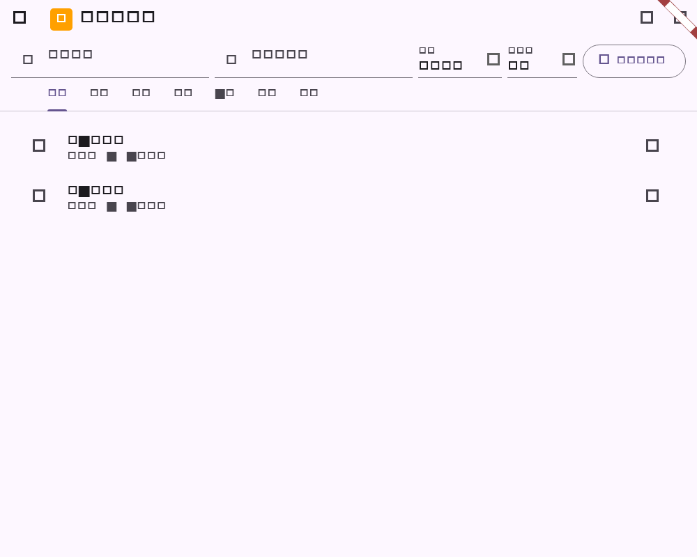
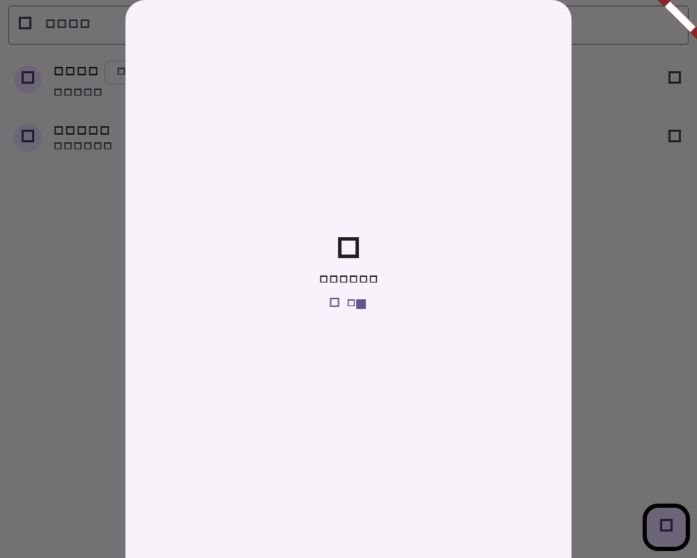

# Flutter 项目任务分页验证

## 范围

- 项目工作区打开任务视图时连续消费 `projectTaskPage`，直到服务端返回空游标。
- 保持现有列表、看板、日历和甘特视图使用完整任务集合，避免只展示第一页。
- 任务关键词、状态和优先级筛选透传到服务端查询，不在客户端伪造过滤结果。
- 任务请求失败时展示可重试状态，避免错误路径永久停留在加载中。
- 重复游标会终止循环，避免异常服务端响应导致无限请求。

## 自动化验证

| 命令 | 结果 |
| --- | --- |
| `dart format --set-exit-if-changed lib/features/projects/projects_page.dart test/projects_page_test.dart` | 通过 |
| `flutter test test/projects_page_test.dart` | 通过（12 项） |
| `git diff --check` | 通过 |

截图由 `projects_page_test.dart` 生成，展示来自连续两页的任务同时出现在项目工作区列表中；同文件测试还覆盖关键词、状态和优先级参数透传，以及失败重试流程。
