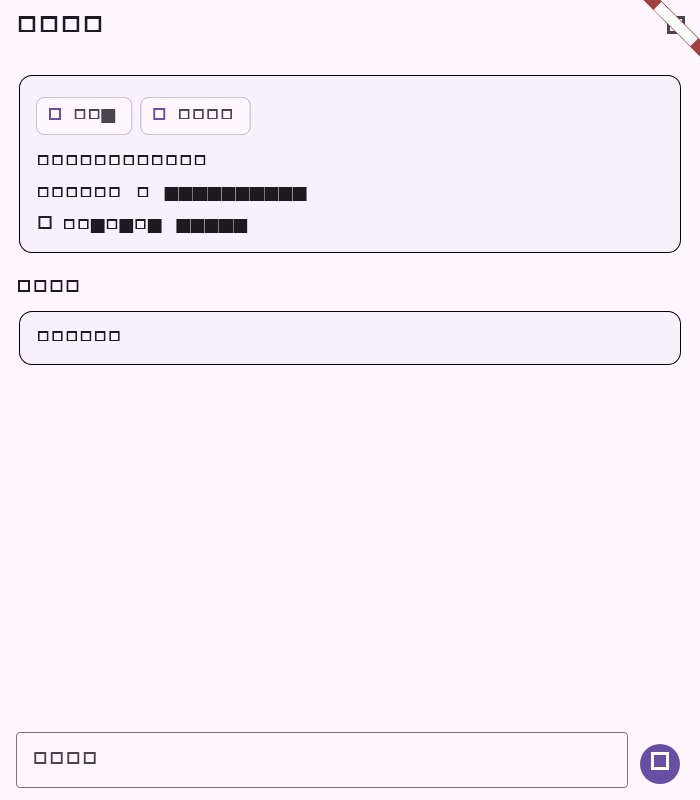

# Flutter 任务提醒详情阶段验证

## 范围

- 任务详情摘要补齐服务端任务 `reminder` 字段展示，与 Web/Desktop 的提醒摘要保持一致。
- 支持一次性提醒、每天/每周/每月周期提醒；每周提醒展示星期，每月提醒展示日期。
- 已完成、已取消或服务端标记暂停的任务显示“已暂停”，已触发/过期状态分别显示对应状态。
- 任务说明按 Markdown 渲染，支持粗体、列表等常用格式，避免把原始标记直接显示给用户。

## 自动化验证

| 命令 | 结果 | 覆盖 |
| --- | --- | --- |
| `dart format --set-exit-if-changed lib/features/projects/project_task_details_page.dart test/project_task_reminder_test.dart` | 通过 | 任务详情和测试格式 |
| `flutter test test/project_task_reminder_test.dart` | 通过（4 项） | 周期提醒、已暂停一次性提醒、Markdown 说明和详情截图 |
| `flutter analyze --no-pub lib/features/projects/project_task_details_page.dart test/project_task_reminder_test.dart` | 通过；无 error | 静态检查 |
| `git diff --check` | 通过 | 空白错误检查 |

## 流程截图

截图由 `project_task_reminder_test.dart` 生成，分辨率为 700x800，展示任务详情中的周期提醒摘要。

## 未覆盖项

提醒的编辑控件仍沿用任务编辑弹窗现有输入；服务端调度、真实通知投递和各平台时区/系统通知表现需在 CI 及真机环境验收。
