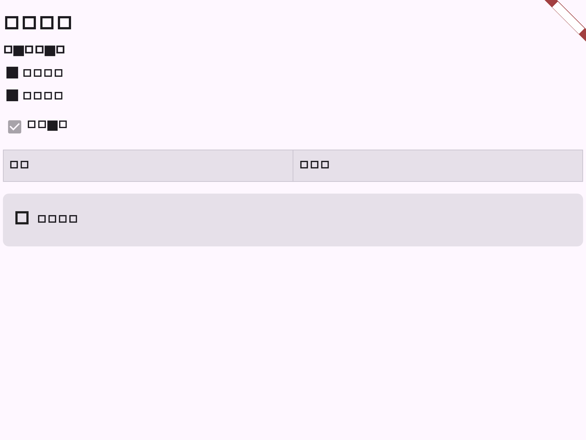

# Flutter 富文档 XML 渲染与文本编辑阶段验证

## 范围

- `RichDocumentView` 读取协作文档的 `Y.XmlFragment("body")`，渲染段落、标题、列表、任务项、引用、代码块、分隔线、表格、图片以及粗体/斜体/下划线/删除线/代码/高亮 marks。
- 远端 Yjs 更新灌入后，页面直接从共享 XML block tree 重建视图，不会将富文档降级为 Markdown 或纯文本并覆盖原有节点。
- 当前入口支持追加标准段落、标题、列表、任务、引用和代码块；已支持长按已有文本块编辑并同步回 Yjs，完整原位格式化工具栏仍待迁移。

## 自动化验证

| 命令 | 结果 | 覆盖 |
| --- | --- | --- |
| `dart format lib/features/projects/document_editor_page.dart lib/features/projects/rich_document_view.dart test/rich_document_view_test.dart ../packages/yjs_dart/lib/src/types/abstract_type.dart` | 通过 | 本阶段 Dart 格式 |
| `flutter analyze --no-pub lib/features/projects/document_editor_page.dart lib/features/projects/rich_document_view.dart test/rich_document_view_test.dart` | 通过；无 error | 页面、渲染器和 Widget 测试静态检查 |
| `flutter test test/rich_document_view_test.dart test/document_collaboration_test.dart test/document_collaboration_screenshot_test.dart` | 通过 | XML block/marks 渲染、文本块编辑、Yjs 协作灌入及截图回归 |
| `git diff --check` | 通过 | 空白错误检查 |

## 流程截图

截图由 `rich_document_view_test.dart` 生成，展示标题、段落、列表、任务项、表格和图片占位；协作页面截图见 `document_collaboration_rich.png`。

## 未覆盖项

完整原位格式工具栏、拖拽块操作、附件上传/解析和各平台真机输入仍需后续阶段接入。
