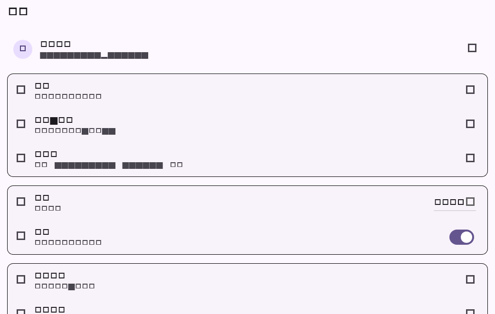

# Flutter 设置页拆分阶段验证

## 范围

- 将设置页从 `lib/main.dart` 迁移到 `lib/features/settings/settings_page.dart`。
- 保持账户资料、服务器切换、多账户、二维码、主题、通知、存储、更新和退出登录入口行为不变。

## 自动化验证

| 命令 | 结果 | 覆盖 |
| --- | --- | --- |
| `dart format --set-exit-if-changed lib/features/settings/settings_page.dart test/settings_page_test.dart` | 通过 | 设置页与测试格式 |
| `flutter test test/settings_page_test.dart` | 通过，1 项 | 设置页入口渲染与截图回归 |
| `flutter analyze --no-fatal-infos` | 通过；无 error/warning，仅仓库既有 info | 静态检查 |
| `git diff --check` | 通过 | 空白错误检查 |

## 流程截图

截图由 Flutter Widget golden 流程生成，分辨率为 1042x662，使用 `DemoRepository` 展示账户、服务器、通知、存储和退出登录入口；真实账号及各平台系统权限弹窗仍需在对应环境执行。

## 未覆盖项

本阶段只调整页面文件边界，没有改变服务端协议。APNs/JPush 厂商 SDK、富文本 `Y.XmlFragment("body")` 编辑绑定和 Android/iOS/Windows/macOS/Linux 真机矩阵仍按迁移矩阵待后续阶段完成。
