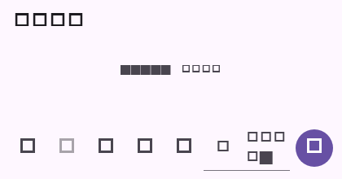

# Flutter 系统事件消息对齐

本次补齐 `system_event` 消息类型：按事件内容生成可读摘要，并在会话中以居中文本展示；未知事件使用稳定的 `[系统消息]` 占位。摘要字段继续保留在原始消息 body 中，便于后续扩展。

| 命令 | 结果 | 说明 |
| --- | --- | --- |
| `flutter test --no-pub test/message_content_test.dart test/message_system_event_test.dart` | 通过（13 项） | 事件摘要、居中 widget 和 golden 回归 |
| `flutter analyze --no-pub lib/domain/message_content.dart lib/main.dart test/message_content_test.dart test/message_system_event_test.dart` | 通过；无 error，仅仓库既有 info | 静态检查 |
| `dart format --set-exit-if-changed lib/domain/message_content.dart lib/main.dart test/message_content_test.dart test/message_system_event_test.dart` | 通过 | Dart 格式 |

